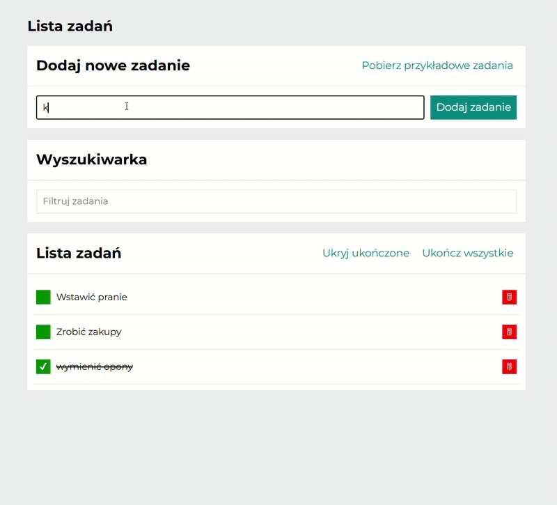

# Tasks list

Welcome to the **Tasks list Manager** app, where you can easily manage your tasks and stay organized! 🚀

### Features:
- **Add Tasks**: Quickly create new tasks with just a few clicks.
- **Task Progress**: Mark tasks as completed or revert them to active with a simple click.
- **Hide Completed Tasks**: Toggle the visibility of completed tasks to keep your list clean and focused.
- **Delete Tasks**: Remove tasks that are no longer needed with a simple delete option.
- **Finish All Tasks**: Mark all tasks as completed at once using a convenient button.
- **Search Tasks**: Easily search through tasks using the built-in search feature to find specific tasks quickly.
- **View Task Details**: Click on a task to view detailed information and get more context about the task.

### How to Use:
1. Add tasks to your list with the input form.
2. Click the checkbox to toggle task completion status.
3. Hide completed tasks for a more organized view, or mark all tasks as completed with a single click.
4. Easily delete tasks when they are no longer needed.
5. Use the search bar to filter and find tasks quickly.
6. Click on any task to view its details and additional information.

### Stay organized and keep track of your tasks with ease. Enjoy! 😎  

## Demo:
Check my demo [here](https://mikoli09.github.io/TasksList-with-React/)

## Technologies used
- **HTML** - Provides website structure,
- **JavaScript** - Adds interactivity and dynamic behavior to the website.
- **Styled-components** - Modular and scoped styling, improving code organization and maintainability.
- **React** - JavaScript library for building user interfaces with components.
- **Create React App** - A tool that sets up a React project with everything you need to start.
- **Webpack** - Bundles JavaScript, CSS, and assets for optimized performance.  
- **Custom hooks** - Manages state and reusable logic, making the code cleaner and easier to maintain.  
- **Redux** - Middleware used for handling side effects in Redux, allowing for asynchronous actions and logic.
- **Redux-Saga** - Middleware used for handling side effects in Redux, allowing for asynchronous actions and logic.
- **React Router** - A library for handling routing in React, enabling navigation between different views and components.
- **React-Toastify** - Library for showing non-intrusive toast notifications to the user.

## Available Scripts

In the project directory, you can run:

### `npm start`

Runs the app in the development mode.\
Open [http://localhost:3000](http://localhost:3000) to view it in your browser.

The page will reload when you make changes.\
You may also see any lint errors in the console.

### `npm run build`

Builds the app for production to the `build` folder.\
It correctly bundles React in production mode and optimizes the build for the best performance.

The build is minified and the filenames include the hashes.\
Your app is ready to be deployed!

See the section about [deployment](https://facebook.github.io/create-react-app/docs/deployment) for more information.

### `npm run eject`

**Note: this is a one-way operation. Once you `eject`, you can't go back!**

If you aren't satisfied with the build tool and configuration choices, you can `eject` at any time. This command will remove the single build dependency from your project.

Instead, it will copy all the configuration files and the transitive dependencies (webpack, Babel, ESLint, etc) right into your project so you have full control over them. All of the commands except `eject` will still work, but they will point to the copied scripts so you can tweak them. At this point you're on your own.

You don't have to ever use `eject`. The curated feature set is suitable for small and middle deployments, and you shouldn't feel obligated to use this feature. However we understand that this tool wouldn't be useful if you couldn't customize it when you are ready for it.

## Contact:

Feel free to contact me: 

**E-mail:** [osojca.marcin1@gmail.com](mailto:osojca.marcin1@gmail.com)
